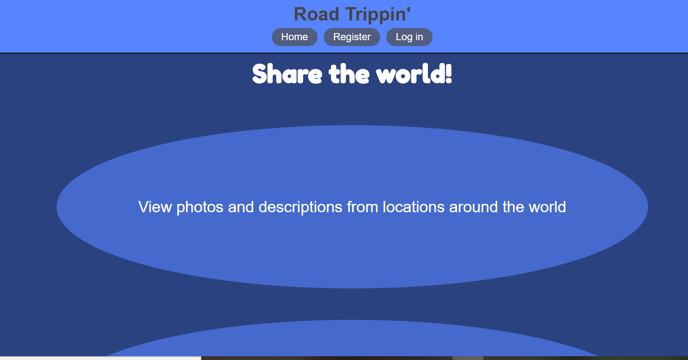

# Road Trippin'

[road-trippin.now.sh](https://road-trippin.now.sh)

## API Documentation

### /photos Endpoint

#### / Route

GET - Get all photos

POST - Post new photo (Auth Token Required)

#### /myPhotos Route

GET - Get photos posted by user (Auth Token Required)

#### /location Route

GET - Get photos by location search (Auth Token Required) - Must add query string, ex. /location?location={query}

#### /:photo_id Route

GET - Get single photo by ID (Auth Token Required)

DELETE - Delete individual photo (Auth Token Required) - Only can be done by user that posted photo

PATCH - Edit photo (Auth Token Required) - Only can be done by user that posted photo - Only can edit text fields (title, description, location)

#### /:photo_id/comments

GET - Get comments for individual photo (Auth Token Required)

### /comments Endpoint

POST - Post comment for current photo (Auth Token Required) - photo_id required in request body

### /auth Endpoint

#### /login Route

POST - Validates user and logs them in

### /users Endpoint

GET - Get list of all users (used for development, not available from front end)

POST - Adds newly registered user to database

## Summary

This app allows the user to register an account and securely log in.  Once inside the user can browse images uploaded by other users, comment on and rate the photos, search by location, upload photos or delete photos they've uploaded and edit text describing the photos they have uploaded.

## Technologies

The technologies I've used here on the back end are NodeJS, Express, CORS, bcrypt, aws-sdk, multer, multer-s3, dotenv, helmet, jsonwebtoken, knex, morgan, treeize, xss, PostgreSQL.

I also used mocha, chai, nodemon, postgrator-cli and supertest during development.

Photo storage is done by uploading photos to an AWS S3 bucket and then saving the url in my PostgreSQL database for convenient retrieval.